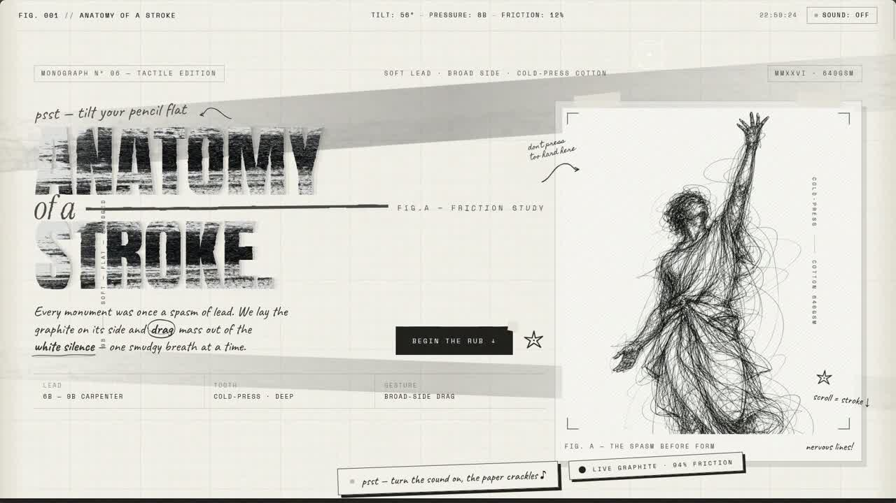
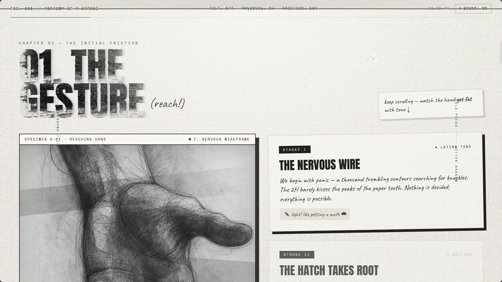
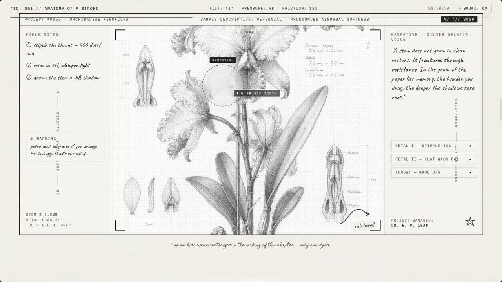
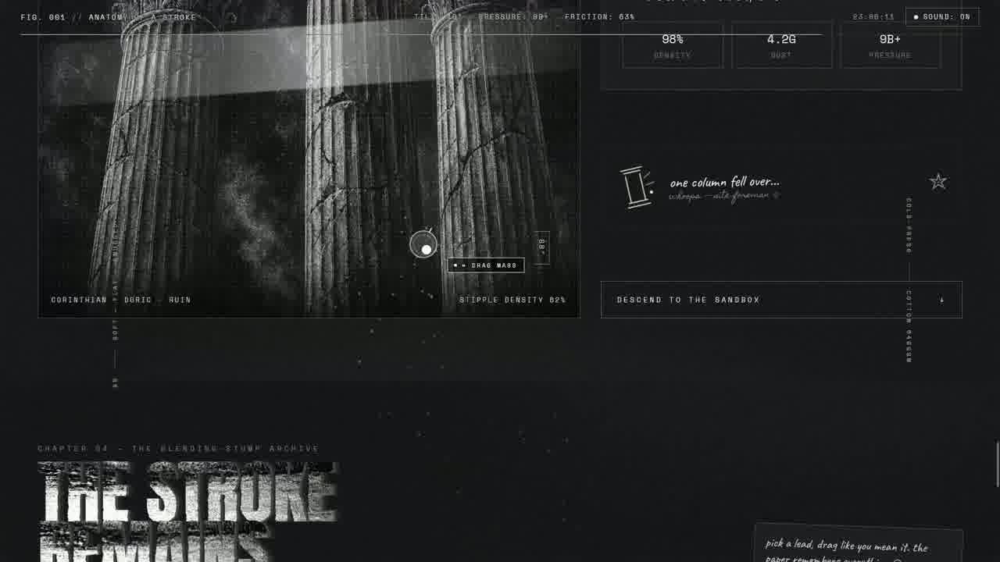
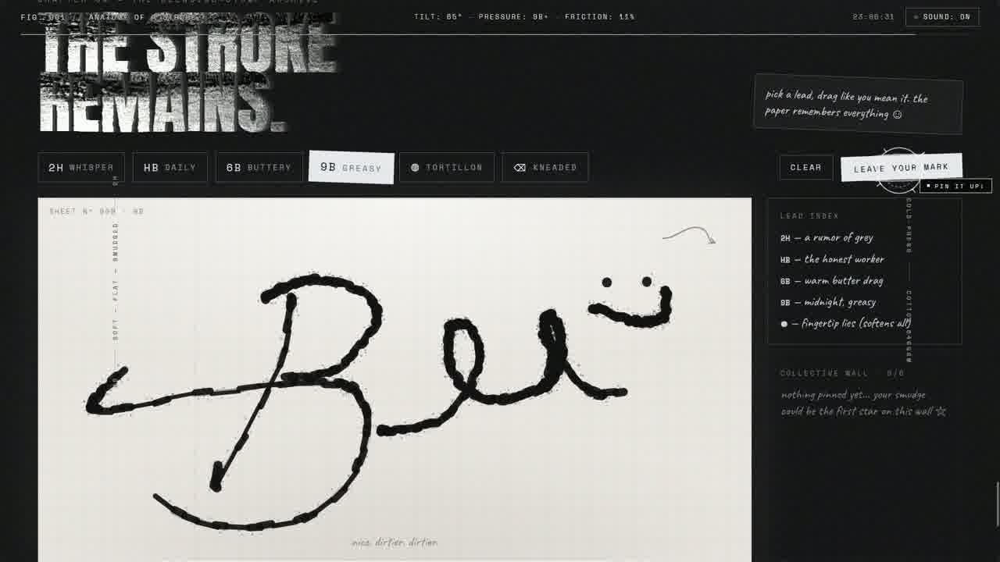
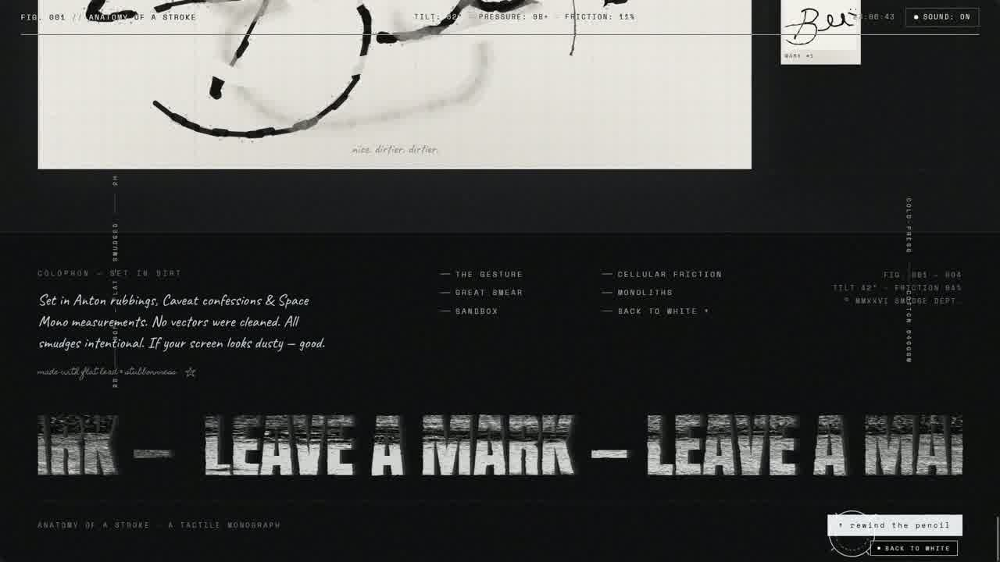

<div align="center">

# Graphite

A tactile digital monograph that simulates the physics of drawing with a flat graphite pencil on cold-press cotton paper.

</div>

---

### The Design

The surface is simulated cold-press cotton paper with visible grain and fiber imperfections. Scrolling does not move the page, it lays down graphite. Content reveals through progressive tonal layering: light wireframe contours first, then cross-hatching, then dense greasy graphite that sculpts form out of the paper tooth.

The cursor is a blending stump. Drag over any graphite region and it smears lead along the paper grain, displaces powder, and exposes white paper underneath. Move fast and dust kicks up.

Halfway through, the atmosphere inverts. Charcoal sweeps smudge the warm paper into deep obsidian slate. Remaining content renders in stippled chalk and silver graphite dust on the dark surface.

Typography is hand-drawn throughout. Headings are heavy graphite flat-rubs. Body text is handwritten script with pressure variation. System labels are monospace uppercase like drafting annotations. The serious aesthetic is broken by spontaneous marginalia: tiny stars, curly arrows, cheeky notes in the margins.

Audio is procedural. Scrolling generates pencil-on-paper friction modulated by velocity. Cursor smudging produces a powdery whisper. The final chapter is an interactive sandbox where visitors pick a pencil lead and draw directly on the canvas.

---

### Screenshots

<table>
<tr>
<td></td>
<td></td>
<td></td>
</tr>
<tr>
<td></td>
<td></td>
<td></td>
</tr>
</table>

### Video Demo

[Watch the full walkthrough (40s MP4)](demo/demo.mp4)

---

### What's in this repo

```
prompt/
├── master_prompt.md        the original prompt (reproduces this exact site)
└── design_system.md        the design system as a reusable instruction
                            (same aesthetic, your own content and subject matter)

example-output/             the complete generated website, unedited
```

`master_prompt.md` is the full creative direction that produced the example output. Exact color palettes, shader specs, chapter narratives, typography rules, audio synthesis, interaction mechanics. Use it as-is to get this exact result.

`design_system.md` is the design language generalized. Locks in the aesthetic but leaves subject matter, content, and narrative open for you to define.

### Run the example

```bash
cd example-output
npm install
npm run dev
```

---

### License

```text
MIT License

Copyright (c) 2026 Bee

Permission is hereby granted, free of charge, to any person obtaining a copy
of this software and associated documentation files (the "Software"), to deal
in the Software without restriction, including without limitation the rights
to use, copy, modify, merge, publish, distribute, sublicense, and/or sell
copies of the Software, and to permit persons to whom the Software is
furnished to do so, subject to the following conditions:

The above copyright notice and this permission notice shall be included in all
copies or substantial portions of the Software.

THE SOFTWARE IS PROVIDED "AS IS", WITHOUT WARRANTY OF ANY KIND, EXPRESS OR
IMPLIED, INCLUDING BUT NOT LIMITED TO THE WARRANTIES OF MERCHANTABILITY,
FITNESS FOR A PARTICULAR PURPOSE AND NONINFRINGEMENT. IN NO EVENT SHALL THE
AUTHORS OR COPYRIGHT HOLDERS BE LIABLE FOR ANY CLAIM, DAMAGES OR OTHER
LIABILITY, WHETHER IN AN ACTION OF CONTRACT, TORT OR OTHERWISE, ARISING FROM,
OUT OF OR IN CONNECTION WITH THE SOFTWARE OR THE USE OR OTHER DEALINGS IN THE
SOFTWARE.
```

<div align="center">
<br>

*No vectors were cleaned. All smudges intentional. If your screen looks dusty, good.*

</div>
