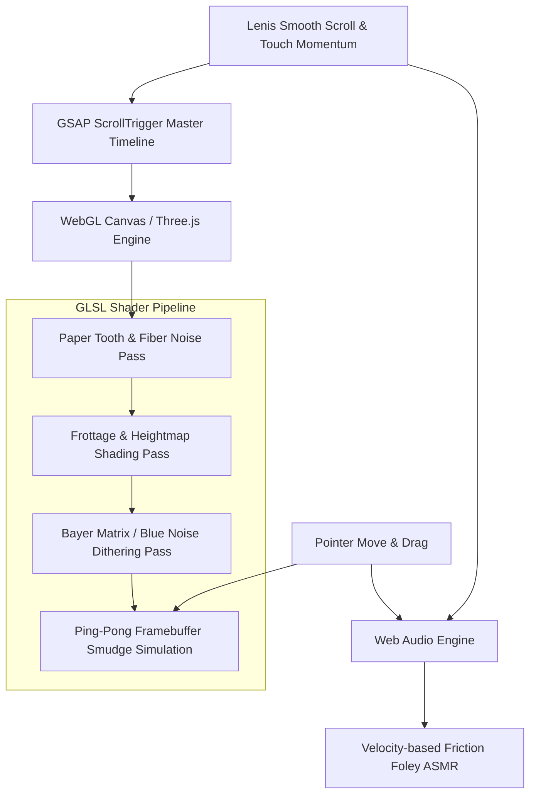

# GRAPHITE
### Reusable Design System & Technical Creative Direction

> **Design Language:** Tactile graphite monograph. Analog friction, paper tooth, scroll-driven sculpting, and the raw physics of flat graphite lead on cold-press cotton paper, translated into a digital interactive experience.
> **Usage:** This document defines the full design system. Supply your own title, subject matter, chapter content, and visual motifs. The design language stays locked in.

---

## 1. Core Prompt (Paste this, then append your content brief below it)

```markdown
Create an interactive web experience using the Graphite design system. The design language fuses high-end conceptual art direction with the raw, visceral tactile physics of drawing with a soft, broad graphite pencil tilted flat against heavy cold-press cotton paper.

### Core Philosophy & Aesthetic
- The entire digital medium mimics authentic drawing friction: the tooth of heavyweight rag paper, the directional grain of a 6B to 9B carpenter pencil stroked on its broad side, and the powdery dispersion of smudged charcoal.
- Avoid typical clean UI tropes, generic sans-serif templates, or flat digital vector graphics. The aesthetic is tactile, artistic, and analog, executed with cutting-edge web engineering.

### Canvas & Atmospheric Transition (Dynamic Inversion)
- The canvas begins on tactile, warm archival cold-press paper (#F5F2EB) with visible organic paper tooth, subtle deckled edges, fiber imperfections, and faint 2H pencil drafting grids.
- At a defined scroll point, broad charcoal sweeps aggressively smudge and drag across the screen, inverting the atmosphere into a deep obsidian and charcoal slate (#0D0D0E).
- Post-inversion content is rendered in stippled white chalk, luminous dithered silver graphite dust, and stark highlights against the dark surface.

### Kinetic Shading & Scroll-Driven Sculpting
- Scrolling does not translate the page. It operates as an invisible, deliberate graphite stroke.
- As the user scrolls, broad textured lead sweeps lay down progressive layers of tone: light gestural wireframe contours first, then textured midtone cross-hatching, then dense greasy graphite masses that sculpt form out of the paper tooth.
- Content should feel like it is being drawn into existence by the act of scrolling.

### Interactive Blending Stump (Tortillon) Cursor
- The cursor functions as a live blending tool.
- Hovering or dragging over graphite-shaded regions dynamically smears the lead particles across the paper grain, displacing powder, softening sharp contours, and exposing the rough white paper tooth beneath.
- Velocity Sensitivity: Moving the cursor rapidly causes graphite dust specks to kick up and settle gently onto the canvas.

### Full Raw Sketchbook Lettering & Playful Marginalia
- Display & Headings: Rendered as heavy, rough graphite flat-rubs (as if a flat carpenter pencil was rubbed across a textured stencil), showing gritty directional drag and paper texture.
- Body Copy & Narrative: Flowing, authentic artist handwriting written in graphite script with realistic pressure sensitivity and imperfect kerning.
- Marginalia & Doodles: The serious aesthetic is balanced by charming, spontaneous sketchbook annotations in the margins. Whimsical curly arrows, tiny hand-drawn stars, cheeky marginal notes, miniature smiley stamps, and delicate scribbled flourishes.

### Tactile ASMR Audio & Organic Foley
- Integrated procedural Web Audio system:
  - Scrolling generates the crisp, textured scraping sound of soft lead rubbing across rough paper grain, dynamically modulated by scroll velocity.
  - Cursor smudging produces a soft, powdery whisper of graphite dust shifting across the canvas.
  - Interactive clicks and section snaps produce a delicate wooden pencil tap or kneaded eraser thump.
  - Features a minimal sound toggle in the corner (Sound: On / Off).
```

---

## 2. Granular Art Direction & Color Palette

### Chromatic Architecture
```
[LIGHT PHASE: ARCHIVAL BONE CANVAS]
┌─────────────────────────────────────────────────────────────┐
│ Paper Base:       #F5F2EB (Cold-Press Cotton Rag)           │
│ Paper Shadow:     #E8E3D7 (Tonal variation & fiber density) │
│ Drafting Grid:    #D5CFC2 (Faint 2H technical construction) │
│ Midtone Graphite: #4A4743 (4B flat broad sweep)             │
│ Deep Shadow:      #1A1918 (8B greasy graphite mass)         │
│ Margin Doodle:    #2C2A29 (Loose mechanical lead script)    │
└─────────────────────────────────────────────────────────────┘

[DARK PHASE: OBSIDIAN SLATE INVERSION]
┌─────────────────────────────────────────────────────────────┐
│ Slate Abyss:      #0D0D0E (Matte charcoal slate)            │
│ Deep Shadow:      #070708 (Compressed volcanic dark)        │
│ Silver Dust:      #7E8084 (Crushed graphite particle haze)  │
│ Chalk Highlight:  #E8EAED (Luminous dithered stipple)       │
│ Accent Glow:      #C8D0D8 (Subtle specular reflection)      │
└─────────────────────────────────────────────────────────────┘
```

---

## 3. Chapter Structure & Layout Pattern

### Navigation & Fixed Interface
- **Top Bar (Minimal Framing):**
  - Left: `FIG. 001 // [YOUR PROJECT TITLE]` (Hand-sketched drafting tag).
  - Center: `TILT: 42° - PRESSURE: 8B - FRICTION: 94%` (Dynamic live telemetry that updates with scroll).
  - Right: `[ SOUND: ON ]` (Minimal clickable toggle).

### Chapter Template (Repeat for each section)

Each chapter follows this structure. Define your own content for each:

- **Chapter Label:** Monospace, uppercase, small. `CHAPTER [N] - [SUBTITLE]`
- **Visual Motif:** [Your primary visual for this section. Revealed through scroll-driven tonal layering.]
- **Display Heading:** `[NUMBER]. [TITLE]` (Rendered as heavy graphite flat-rub lettering).
- **Narrative Copy (Handwritten):**
  > *[Your poetic/narrative body text for this chapter, rendered in flowing graphite handwriting script.]*
- **Marginalia Doodles:**
  - [Spontaneous sketchy annotations, arrows, tiny doodles, cheeky notes relevant to your content]
- **Interactive Trigger:**
  - [At least one cursor-driven smudge/drag interaction per chapter]

### The Inversion Event (Between light and dark phases)
- **Visual Mechanic:** The scroll locks briefly as a virtual blending stump sweeps across the screen, smearing the white paper into deep velvet charcoal darkness.
- **Sound:** A resonant, deep powdery drag sound that transitions into an ambient low drone.

### Final Chapter (Interactive Sandbox)
- **Visual Motif:** An interactive canvas where visitors can test different pencil leads (2H, HB, 6B, 9B, Blending Stump, Kneaded Eraser) directly on an interactive drawing surface.
- **Display Heading:** `[YOUR CLOSING STATEMENT]`
- **Call to Action:** A hand-circled button: `[ LEAVE YOUR MARK ]` allowing visitors to draw and sign the page in real-time graphite.

---

## 4. Technical Architecture & Shader Pipeline



### 1. Paper Tooth Shader (GLSL)
- Fractional Brownian Motion (fBM) layered over high-frequency simplex noise.
- Heightmap modulation controls where flat graphite touches first (peaks of paper grain) versus where it stays light (valleys of the paper tooth).

### 2. Frottage Lead Shading Shader
- Uniforms: `u_scrollProgress`, `u_leadAngle` (e.g., 42° tilt), `u_pressure` (0.0 to 1.0), `u_hardness` (2H to 9B).
- As `u_scrollProgress` increases, the threshold expands, filling paper valleys with dense, non-linear graphite pigment.

### 3. Dynamic Smudge & Particle Buffer
- Two ping-pong framebuffers record cursor velocity vectors.
- A diffusion-reaction GLSL pass spreads sampled texture outwards along the velocity vector, with a decay factor simulating the finite amount of lead on the blending stump.

### 4. Dithering & Stipple Engine (For Dark Phase)
- Ordered dithering using an 8x8 Bayer matrix mixed with blue noise for organic distribution of chalk specks and graphite dust.

---

## 5. Audio Synthesis & ASMR Implementation

| Event | Audio Implementation | Sonic Character |
|---|---|---|
| **Slow Scroll** | High-pass filtered pink noise with micro-grain granular synthesis | Crisp, delicate 2H pencil glide on dry paper |
| **Rapid Scroll** | Resonant bandpass friction scraping with pitch jitter | Heavy 8B carpenter lead dragging vigorously |
| **Cursor Smudge** | Low-frequency white noise filtered with high resonance at 800Hz | Whispering powder, dry skin against cold-press cotton |
| **Section Inversion** | Sub-bass impact (45Hz sine) decaying into a sustained grainy drone | Stone shifting, velvet darkness falling |
| **Click / Tap** | Short transient impulse (3ms) with high wood resonance (2.4kHz) | Solid cedarwood pencil tip tapping drafting table |
