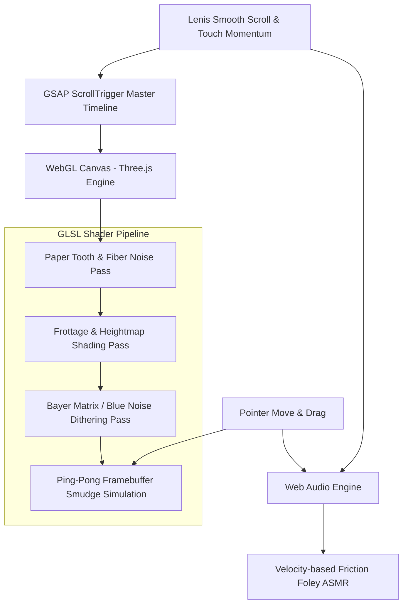

# THE ANATOMY OF A STROKE
### Master Enhanced Prompt & Technical Creative Direction

> **Project Target:** Awwwards Site of the Year / FWA of the Month Caliber Interactive Experience  
> **Core Concept:** *The Anatomy of a Stroke* — An experimental tactile digital monograph exploring analog friction, paper tooth, and the sculptural power of the flat graphite lead in a digital dimension.

---

## 1. Executive Master Prompt (Copy & Paste Ready)

```markdown
Create a world-class, avant-garde interactive web experience titled "The Anatomy of a Stroke". The design language must feel completely unexplored—fusing high-end conceptual art direction with the raw, visceral tactile physics of drawing with a soft, broad graphite pencil tilted flat against heavy cold-press cotton paper.

### Core Philosophy & Aesthetic
- The entire digital medium mimics authentic drawing friction: the tooth of heavyweight rag paper, the directional grain of a 6B–9B carpenter pencil stroked on its broad side, and the powdery dispersion of smudged charcoal.
- Avoid typical clean UI tropes, generic sans-serif templates, or flat digital vector graphics. The aesthetic is tactile, artistic, and breathtakingly analog, executed with cutting-edge WebGL/GLSL shader engineering.

### Canvas & Atmospheric Transition (Dynamic Inversion)
- Chapter 1 & 2 (The Awakening): The canvas begins on tactile, warm archival cold-press paper (#F5F2EB) with visible organic paper tooth, subtle deckled edges, fiber imperfections, and faint 2H pencil drafting grids.
- The Inversion Transition: As the user scrolls into Chapter 3, broad charcoal sweeps aggressively smudge and drag across the screen, inverting the atmosphere into a deep obsidian and charcoal slate (#0D0D0E).
- Chapter 3 (The Monoliths): The dark slate canvas is illuminated by stippled white chalk, luminous dithered silver graphite dust, and stark chiseled architectural silhouettes rising from the abyss.

### Kinetic Shading & Scroll-Driven Sculpting
- Scrolling does not simply translate the page; it operates as an invisible, deliberate graphite stroke.
- As the user scrolls, broad, textured lead sweeps lay down progressive layers of tone—starting from light gestural wireframe contours, building into textured midtone cross-hatching, and culminating in dense, greasy graphite masses that sculpt 3D anatomical and architectural forms out of the paper tooth.
- Form Subject Progression:
  1. Human Gestures & Anatomy: Expressive reaching hands, muscular tension, and continuous contour wireframes that coalesce into volumetric figurative sculptures.
  2. Botanical Specimens: Delicate stippled orchids, fibrous stems, and scientific cross-sections merging organic beauty with analytical drafting tags.
  3. Brutalist Monoliths (The Inversion): Colossal Greco-Roman pillars, towering concrete cantilevers, and structural ruins emerging via high-density dithered stipple and charcoal blocks.

### Interactive Blending Stump (Tortillon) Cursor
- The cursor functions as a live blending tool (or artist's fingertip).
- Hovering or dragging over graphite-shaded regions dynamically smears the lead particles across the paper grain, displacing powder, softening sharp contours, and exposing the rough white paper tooth beneath.
- Velocity Sensitivity: Moving the cursor rapidly causes graphite dust specks to kick up and settle gently onto the canvas.

### Full Raw Sketchbook Lettering & Playful Marginalia
- Display & Headings: Rendered as heavy, rough graphite flat-rubs (as if a flat carpenter pencil was rubbed across a textured stencil), showing gritty directional drag and paper texture.
- Body Copy & Narrative: Flowing, authentic artist handwriting written in graphite script with realistic pressure sensitivity and imperfect kerning.
- Marginalia & Cute Doodles: The solemn brutalism is balanced by charming, spontaneous sketchbook annotations in the margins—whimsical curly arrows, tiny hand-drawn stars, cheeky marginal notes ("don't press too hard here", "smudge this part"), miniature smiley stamps, and delicate scribbled botanical flourishes.

### Tactile ASMR Audio & Organic Foley
- Integrated procedural/sampled Web Audio system that brings the friction alive:
  - Scrolling generates the crisp, textured scraping sound of a soft lead rubbing across rough paper grain, dynamically modulated by scroll velocity.
  - Cursor smudging produces a soft, powdery whisper of graphite dust shifting across the canvas.
  - Interactive clicks and section snaps produce a delicate wooden pencil tap or kneaded eraser thump.
  - Features an elegant, minimal sound toggle in the corner (Mute / Soundscape Active).
```

---

## 2. Granular Art Direction & Color Palette

### Chromatic Architecture
```
[CHAPTER 1 & 2: ARCHIVAL BONE CANVAS]
┌─────────────────────────────────────────────────────────────┐
│ Paper Base:       #F5F2EB (Cold-Press Cotton Rag)           │
│ Paper Shadow:     #E8E3D7 (Tonal variation & fiber density) │
│ Drafting Grid:    #D5CFC2 (Faint 2H technical construction) │
│ Midtone Graphite: #4A4743 (4B flat broad sweep)             │
│ Deep Shadow:      #1A1918 (8B greasy graphite mass)         │
│ Margin Doodle:    #2C2A29 (Loose mechanical lead script)    │
└─────────────────────────────────────────────────────────────┘

[CHAPTER 3: OBSIDIAN MONOLITH INVERSION]
┌─────────────────────────────────────────────────────────────┐
│ Slate Abyss:      #0D0D0E (Matte charcoal slate)            │
│ Deep Shadow:      #070708 (Compressed volcanic dark)        │
│ Silver Dust:      #7E8084 (Crushed graphite particle haze)  │
│ Chalk Highlight:  #E8EAED (Luminous dithered stipple)       │
│ Accent Glow:      #C8D0D8 (Subtle specular reflection)      │
└─────────────────────────────────────────────────────────────┘
```

---

## 3. Narrative Chapter Breakdown & Copywriting

### Navigation & Fixed Interface
- **Top Bar (Minimal Framing):**
  - Left: `FIG. 001 // THE ANATOMY OF A STROKE` (Hand-sketched drafting tag).
  - Center: `TILT: 42° — PRESSURE: 8B — FRICTION: 94%` (Dynamic live telemetry).
  - Right: `[ SOUND: ACTIVE ]` (Minimal clickable toggle).

### Chapter 01 — *The Initial Friction* (Bone Paper)
- **Visual Motif:** A single reaching anatomical hand formed from nervous, continuous wireframe scribbles. As the user scrolls, broad horizontal side-strokes wash over it, locking the fingers and palm into sculpted 3D volume.
- **Display Heading:** `01. THE GESTURE` (Rubbed with a broad 8B flat carpenter lead).
- **Narrative Copy (Handwritten):**
  > *"Every monument was once a spasm of lead. We press the flat edge of the graphite against the tooth of the cotton—not to dictate form, but to coax mass out of the white silence."*
- **Marginalia Doodles:**
  - A small scribbled swirl with an arrow: *"too tight here"*
  - A tiny three-pointed star doodle next to the scroll indicator.
  - A hand-drawn circle around the word *"silence"* with a micro smiley face inside it.

---

### Chapter 02 — *Botanical Equilibrium* (Bone Paper)
- **Visual Motif:** An intricate botanical specimen (Orchidaceae) where stippled dithering, delicate fine-line veins, and wide charcoal smudges create an interplay of organic delicacy and raw graphite weight.
- **Display Heading:** `02. CELLULAR FRICTION` (Textured frottage letterforms).
- **Narrative Copy (Handwritten):**
  > *"A stem does not grow in clean vectors. It fractures through resistance. In the grain of the paper lies memory: the harder you drag the pencil, the deeper the shadows take root."*
- **Interactive Trigger:**
  - Visitors can drag their cursor across the petals to smudge the pollen dust into the margin.
  - Margin note: *"try rubbing the blossom ↗"* with a wavy hand-sketched pointer.

---

### The Inversion Event — *The Great Smear*
- **Visual Mechanic:** The scroll locks briefly as a virtual blending stump sweeps vertically and horizontally across the screen, smearing the white paper into deep, velvet charcoal darkness.
- **Sound:** A resonant, deep powdery drag sound that transitions into an ambient low drone.

---

### Chapter 03 — *Monolithic Silence* (Obsidian Slate)
- **Visual Motif:** Colossal Corinthian and Doric columns rising out of the black void, drawn in dithered stippling, white chalk dust, and deep architectural block-shading.
- **Display Heading:** `03. ARCHITECTURAL RUINS` (Carved from white chalk rubbing on stone).
- **Narrative Copy (Handwritten in silver lead):**
  > *"When the light is exhausted, we sculpt with dust. Pillars raised from crushed stone and stippled memory, standing immune to the erasure of time."*
- **Marginalia Doodles:**
  - Faint architectural dimension lines (`12.4m`, `88°`).
  - A playful doodle of a tiny column falling over in the corner with the caption: *"whoops"*.

---

### Chapter 04 — *The Epilogue (The Blending Stump Archive)*
- **Visual Motif:** An interactive sketchbook sandbox where users can test different pencil leads (2H, HB, 6B, 9B, Blending Stump, Kneaded Eraser) directly on an interactive canvas and save their created stroke to the collective gallery.
- **Display Heading:** `THE STROKE REMAINS.`
- **Call to Action:** A hand-circled button: `[ LEAVE YOUR MARK ]` which allows visitors to sign the page in real-time graphite.

---

## 4. Technical Architecture & Shader Pipeline



### 1. Paper Tooth Shader (GLSL)
- Utilizes Fractional Brownian Motion (fBM) layered over high-frequency simplex noise.
- Heightmap modulation controls where the flat graphite touches first (peaks of the paper grain) versus where it stays light (valleys of the paper tooth).

### 2. Frottage Lead Shading Shader
- Uniforms: `u_scrollProgress`, `u_leadAngle` (e.g., 42° tilt), `u_pressure` (0.0 to 1.0), `u_hardness` (2H to 9B).
- As `u_scrollProgress` increases, the threshold expands, filling the paper valleys with dense, non-linear graphite pigment.

### 3. Dynamic Smudge & Particle Buffer
- Two ping-pong framebuffers record cursor velocity vectors.
- A diffusion-reaction GLSL pass spreads the sampled texture outwards along the velocity vector, with a decay factor simulating the finite amount of lead on the blending stump.

### 4. Dithering & Stipple Engine (For Columns & Inversion)
- Ordered dithering using an $8 \times 8$ Bayer matrix mixed with blue noise for organic distribution of chalk specks and graphite dust.

---

## 5. Audio Synthesis & ASMR Implementation Plan

| Event | Audio Implementation | Sonic Character |
|---|---|---|
| **Slow Scroll** | High-pass filtered pink noise with micro-grain granular synthesis | Crisp, delicate 2H pencil glide on dry paper |
| **Rapid Scroll** | Resonant bandpass friction scraping with pitch jitter | Heavy 8B carpenter lead dragging vigorously |
| **Cursor Smudge** | Low-frequency white noise filtered with high resonance at 800Hz | Whispering powder, dry skin against cold-press cotton |
| **Section Inversion** | Sub-bass impact (45Hz sine) decaying into a sustained grainy drone | Monumental stone shifting, velvet darkness falling |
| **Click / Tap** | Short transient impulse (3ms) with high wood resonance (2.4kHz) | Solid cedarwood pencil tip tapping drafting table |

---

## 6. How to Use This Prompt
1. **For Creative Developers / Designers:** Pass this entire document into your design sprint, Figma design system, or creative coding environment (Three.js / React Three Fiber / GSAP).
2. **For AI Agents / Coding Assistants:** Supply this prompt as the master specification. The prompt contains exact color hexes, shader logic, typography rules, narrative texts, and layout mechanics to build a fully bespoke, unforgettable web experience.
